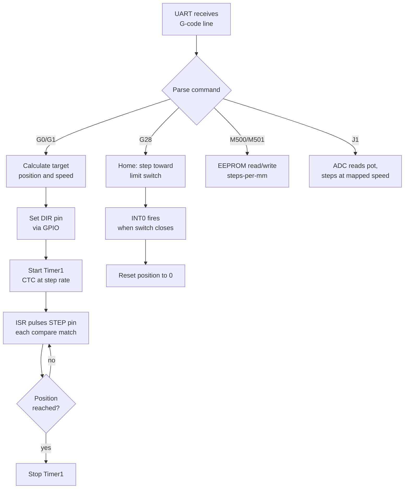

import TawkWidget from '../../../../components/TawkWidget.astro';
import UniversalContentContributors from '../../../../components/UniversalContentContributors.astro';
import InArticleAd from '../../../../components/InArticleAd.astro';
import Copyright from '../../../../components/Copyright.astro';
import BionicText from '../../../../components/BionicText.astro';
import TailwindWrapper from '../../../../components/TailwindWrapper.jsx';
import { Tabs, TabItem } from '@astrojs/starlight/components';
import { Card, CardGrid, Badge, Steps, LinkButton, FileTree } from '@astrojs/starlight/components';

<UniversalContentContributors 
  contributors={frontmatter.contributors}
/>


import EmbeddedProgrammingAtmega328pComments from '../../../../components/embedded-programming-atmega328p/EmbeddedProgrammingAtmega328pComments.astro';

Real firmware rarely uses just one peripheral. CNC machines, 3D printers, and laboratory positioning stages combine timers, interrupts, serial communication, analog input, and non-volatile storage into a single program that must respond to multiple events without missing a step pulse. This lesson builds a single-axis stepper motor controller that accepts movement commands over UART, generates precisely timed step pulses, homes against a limit switch, and lets you jog the axis with a potentiometer. Every peripheral from the course appears in one working system. #StepperMotor #CNC #MotionControl

## What We Are Building

<Card title="Single-Axis Stepper Motor Controller" icon="star">
A CNC-style motion controller for one linear axis. The ATmega328P receives G-code movement commands over UART from a PC, generates precisely timed step pulses using Timer1 in CTC mode, and drives a NEMA 17 stepper motor through an A4988 driver module. A normally-open limit switch on INT0 provides a home reference position. A 10K potentiometer on ADC channel 0 allows manual jog control. Steps-per-millimeter calibration is stored in EEPROM so it survives power cycles. The controller handles rapid moves, feedrate moves, homing, position reporting, and jog mode.
</Card>

**Project specifications:**

| Parameter | Value |
|-----------|-------|
| MCU | ATmega328P on Arduino Nano (16 MHz) |
| Motor | NEMA 17 bipolar stepper (200 steps/rev, 1.8 degrees/step) |
| Driver | A4988 or DRV8825 (full step mode) |
| Motor supply | 12V external |
| Serial | 115200 baud (U2X mode for low error) |
| Default calibration | 25 steps/mm (8 mm pitch leadscrew) |
| Speed range | 1 to 3000+ mm/min |
| Commands | G0, G1, G28, M114, M500, M501, J1 |

## Peripherals Used

<InArticleAd />


This project ties together every major peripheral from Lessons 1 through 9:

| Peripheral | Lesson | Role in This Project |
|-----------|--------|---------------------|
| GPIO | 2 | STEP and DIR pins to A4988 driver |
| Timer1 (CTC) | 3 | Precise step pulse timing at variable frequency |
| INT0 | 4 | Limit switch interrupt for homing |
| UART | 5 | Receive G-code commands from PC |
| ADC | 8 | Read jog potentiometer for manual control |
| EEPROM | 9 | Store and recall steps-per-mm calibration |

## Hardware Setup

<InArticleAd />


The stepper driver module (A4988 or DRV8825) simplifies wiring. It takes two logic signals from the ATmega328P (STEP and DIR) and handles the motor coil sequencing and current regulation internally.

```text
  ATmega328P             A4988 Driver          NEMA 17
  +--------+           +----------+           +-------+
  |    PD4 |--[STEP]-->| STEP     |     1A -->| Coil  |
  |    PD5 |--[DIR]--->| DIR      |     1B -->|   A   |
  |        |           |          |     2A -->| Coil  |
  |    PD2 |<--[INT0]--| (limit)  |     2B -->|   B   |
  |    PC0 |<--[ADC0]--| (pot)    |           +-------+
  |        |           | VMOT     |<-- 12V
  |    GND |---------->| GND      |
  +--------+           +----------+
                        MS1,MS2,MS3 = GND (full step)

  Limit switch: NO between PD2 and GND (internal pull-up)
  Jog pot: 10K between VCC and GND, wiper to PC0
```

### Parts List

| Part | Connection | Notes |
|------|-----------|-------|
| A4988 stepper driver | STEP to PD4, DIR to PD5 | Set current limit before powering motor |
| NEMA 17 stepper motor | 4 wires to A4988 | 200 steps/rev (1.8 degrees/step) |
| Limit switch (NO) | PD2 to GND | Normally open, closes at home position |
| 10K potentiometer | Wiper to PC0 | VCC and GND on outer pins |
| 12V power supply | A4988 VMOT | Separate from USB 5V |

## Step Pulse Timing

<InArticleAd />


A stepper motor moves one step for each rising edge on the STEP pin. The step rate determines the motor speed. Timer1 in CTC mode generates these pulses at a precise frequency.

For a motor with 200 steps per revolution driving a leadscrew with 8 mm pitch (common on 3D printers), one revolution moves 8 mm. That gives 200/8 = 25 steps per mm.

To move at a feedrate of F mm/min:

```
steps_per_second = (F / 60) * steps_per_mm
```

For F = 300 mm/min with 25 steps/mm: steps_per_second = 5 * 25 = 125 Hz. Timer1 at 16 MHz with prescaler 64 gives:

```
OCR1A = (F_CPU / (2 * prescaler * steps_per_second)) - 1
```

For 125 Hz: OCR1A = (16000000 / (2 * 64 * 125)) - 1 = 999. The ISR toggles the STEP pin on each compare match.

At higher speeds (e.g., 3000 mm/min = 1250 Hz), OCR1A = 99. Timer1's 16-bit range handles speeds from below 1 step/s up to tens of thousands of steps/s.

## G-code Parser

<InArticleAd />


Full CNC G-code is complex, but a single-axis controller needs only a handful of commands:

| Command | Meaning | Example |
|---------|---------|---------|
| G0 Xnn | Rapid move to position nn mm | `G0 X0` (go home fast) |
| G1 Xnn Fnnn | Linear move at feedrate | `G1 X50 F300` |
| G28 | Home: move toward limit switch | `G28` |
| M114 | Report current position | `M114` |
| M500 | Save steps/mm to EEPROM | `M500` |
| M501 | Load steps/mm from EEPROM | `M501` |

The parser reads one line at a time from the UART ring buffer, extracts the command letter and numeric values, and calls the appropriate motion function.

## Complete Firmware

<InArticleAd />


```c
#define F_CPU 16000000UL
#define BAUD 115200
#define UBRR_VAL ((F_CPU / (8UL * BAUD)) - 1)  /* U2X mode */

#include <avr/io.h>
#include <avr/interrupt.h>
#include <avr/eeprom.h>
#include <util/atomic.h>
#include <stdlib.h>
#include <string.h>
#include <ctype.h>

/* --- Pin definitions --- */
#define STEP_PIN   PD4
#define DIR_PIN    PD5
#define LIMIT_PIN  PD2  /* INT0 */

#define EE_STEPS_MM ((float *)0)  /* EEPROM address for calibration */

/* --- Global state --- */
static volatile int32_t current_pos = 0;   /* steps from home */
static volatile int32_t target_pos  = 0;
static volatile uint8_t moving      = 0;
static volatile uint8_t limit_hit   = 0;
static volatile uint8_t homing      = 0;

static float steps_per_mm = 25.0;  /* default: 200 steps/rev, 8mm pitch */
static float feedrate = 300.0;     /* mm/min */
static float rapid_rate = 1000.0;  /* mm/min for G0 */

/* ================================
   UART (with U2X for 115200 baud)
   ================================ */
static void uart_init(void)
{
    UBRR0H = (uint8_t)(UBRR_VAL >> 8);
    UBRR0L = (uint8_t)(UBRR_VAL);
    UCSR0A = (1 << U2X0);  /* Double speed for lower baud error */
    UCSR0B = (1 << TXEN0) | (1 << RXEN0);
    UCSR0C = (1 << UCSZ01) | (1 << UCSZ00);  /* 8N1 */
}

static void uart_putc(char c)
{
    while (!(UCSR0A & (1 << UDRE0)));
    UDR0 = c;
}

static void uart_puts(const char *s)
{
    while (*s) uart_putc(*s++);
}

static void uart_put_i32(int32_t val)
{
    char buf[12];
    ltoa(val, buf, 10);
    uart_puts(buf);
}

static uint8_t uart_available(void)
{
    return (UCSR0A & (1 << RXC0)) ? 1 : 0;
}

static char uart_getc(void)
{
    while (!(UCSR0A & (1 << RXC0)));
    return UDR0;
}

/* Read a full line (up to CR or LF) into buf. Returns length. */
static uint8_t uart_readline(char *buf, uint8_t maxlen)
{
    uint8_t i = 0;
    while (i < maxlen - 1) {
        char c = uart_getc();
        if (c == '\n' || c == '\r') {
            if (i > 0) break;  /* ignore leading newlines */
            continue;
        }
        buf[i++] = toupper(c);
    }
    buf[i] = '\0';
    return i;
}

/* ================================
   ADC (jog potentiometer on PC0)
   ================================ */
static void adc_init(void)
{
    ADMUX = (1 << REFS0);  /* AVcc reference, channel 0 */
    ADCSRA = (1 << ADEN) | (1 << ADPS2) | (1 << ADPS1) | (1 << ADPS0);
}

static uint16_t adc_read(void)
{
    ADCSRA |= (1 << ADSC);
    while (ADCSRA & (1 << ADSC));
    return ADC;
}

/* ================================
   Timer1: step pulse generation
   ================================ */
static void timer1_start(float steps_sec)
{
    if (steps_sec < 1.0) steps_sec = 1.0;

    uint16_t ocr = (uint16_t)(F_CPU / (2UL * 64 * (uint32_t)steps_sec) - 1);
    if (ocr < 1) ocr = 1;

    TCCR1A = 0;
    TCCR1B = (1 << WGM12) | (1 << CS11) | (1 << CS10);  /* CTC, prescaler 64 */
    OCR1A = ocr;
    TCNT1 = 0;
    TIMSK1 = (1 << OCIE1A);
    moving = 1;
}

static void timer1_stop(void)
{
    TIMSK1 = 0;
    TCCR1B = 0;
    moving = 0;
}

/* Timer1 compare match: one step per interrupt */
ISR(TIMER1_COMPA_vect)
{
    if (homing) {
        if (limit_hit) {
            timer1_stop();
            current_pos = 0;
            target_pos = 0;
            homing = 0;
            return;
        }
        /* Step toward home (negative direction) */
        PORTD |= (1 << STEP_PIN);
        PORTD &= ~(1 << STEP_PIN);
        current_pos--;
        return;
    }

    if (current_pos == target_pos) {
        timer1_stop();
        return;
    }

    /* Pulse the STEP pin */
    PORTD |= (1 << STEP_PIN);
    PORTD &= ~(1 << STEP_PIN);

    if (current_pos < target_pos) current_pos++;
    else current_pos--;
}

/* ================================
   INT0: limit switch
   ================================ */
ISR(INT0_vect)
{
    limit_hit = 1;
}

/* ================================
   Motion commands
   ================================ */
static void move_to(float pos_mm, float rate_mm_min)
{
    int32_t target = (int32_t)(pos_mm * steps_per_mm);
    int32_t diff;

    ATOMIC_BLOCK(ATOMIC_RESTORESTATE) {
        target_pos = target;
        diff = target_pos - current_pos;
    }

    if (diff == 0) return;

    /* Set direction */
    if (diff > 0) PORTD |= (1 << DIR_PIN);
    else { PORTD &= ~(1 << DIR_PIN); diff = -diff; }

    float steps_sec = (rate_mm_min / 60.0) * steps_per_mm;
    timer1_start(steps_sec);

    /* Wait for move to complete */
    while (moving) {
        /* Check for limit switch during move */
        if (limit_hit && !homing) {
            timer1_stop();
            uart_puts("!! Limit hit during move\n");
            break;
        }
    }
}

static void do_home(void)
{
    uart_puts("Homing...\n");
    limit_hit = 0;
    homing = 1;

    /* Move in negative direction toward limit switch */
    PORTD &= ~(1 << DIR_PIN);

    float home_speed = 200.0;  /* mm/min */
    float steps_sec = (home_speed / 60.0) * steps_per_mm;
    timer1_start(steps_sec);

    while (homing);  /* Wait for limit switch or timeout */

    uart_puts("Home found. Position reset to 0.\n");
}

/* ================================
   Jog mode (potentiometer control)
   ================================ */
static void jog_check(void)
{
    uint16_t adc = adc_read();

    /* Dead zone in center (480-544): no movement */
    if (adc > 480 && adc < 544) return;

    /* Map ADC to speed: further from center = faster */
    float speed;
    if (adc >= 544) {
        PORTD |= (1 << DIR_PIN);   /* Forward */
        speed = (float)(adc - 544) / 480.0 * 600.0;  /* 0-600 mm/min */
    } else {
        PORTD &= ~(1 << DIR_PIN);  /* Reverse */
        speed = (float)(480 - adc) / 480.0 * 600.0;
    }

    if (speed < 10.0) return;

    /* Single step at computed rate */
    float steps_sec = (speed / 60.0) * steps_per_mm;
    uint16_t delay_us = (uint16_t)(1000000.0 / steps_sec);
    if (delay_us < 100) delay_us = 100;

    PORTD |= (1 << STEP_PIN);
    PORTD &= ~(1 << STEP_PIN);

    if (PORTD & (1 << DIR_PIN)) current_pos++;
    else current_pos--;

    /* Simple delay for step rate */
    for (uint16_t i = 0; i < delay_us / 10; i++) {
        _delay_us(10);
    }
}

/* ================================
   G-code parser
   ================================ */
static float parse_value(const char *line, char letter)
{
    const char *p = line;
    while (*p) {
        if (*p == letter) {
            return atof(p + 1);
        }
        p++;
    }
    return -1.0;
}

static void process_line(const char *line)
{
    if (line[0] == 'G') {
        int cmd = atoi(line + 1);
        float x, f;

        switch (cmd) {
            case 0:  /* G0: rapid move */
                x = parse_value(line, 'X');
                if (x >= 0) move_to(x, rapid_rate);
                break;

            case 1:  /* G1: linear move */
                f = parse_value(line, 'F');
                if (f > 0) feedrate = f;
                x = parse_value(line, 'X');
                if (x >= 0) move_to(x, feedrate);
                break;

            case 28: /* G28: home */
                do_home();
                break;

            default:
                uart_puts("Unknown G command\n");
        }
    } else if (line[0] == 'M') {
        int cmd = atoi(line + 1);

        switch (cmd) {
            case 114: /* M114: report position */
                uart_puts("X:");
                uart_put_i32(current_pos);
                uart_puts(" steps (");
                {
                    int32_t um = (int32_t)(current_pos * 1000.0 / steps_per_mm);
                    uart_put_i32(um / 1000);
                    uart_putc('.');
                    int32_t frac = um % 1000;
                    if (frac < 0) frac = -frac;
                    if (frac < 100) uart_putc('0');
                    if (frac < 10) uart_putc('0');
                    uart_put_i32(frac);
                }
                uart_puts(" mm)\n");
                break;

            case 500: /* M500: save calibration */
                eeprom_update_float(EE_STEPS_MM, steps_per_mm);
                uart_puts("Saved steps/mm: ");
                uart_put_i32((int32_t)steps_per_mm);
                uart_putc('\n');
                break;

            case 501: /* M501: load calibration */
                {
                    float val = eeprom_read_float(EE_STEPS_MM);
                    if (val > 0.0 && val < 10000.0) {
                        steps_per_mm = val;
                        uart_puts("Loaded steps/mm: ");
                        uart_put_i32((int32_t)steps_per_mm);
                        uart_putc('\n');
                    } else {
                        uart_puts("No valid calibration in EEPROM\n");
                    }
                }
                break;

            default:
                uart_puts("Unknown M command\n");
        }
    } else if (line[0] == 'J') {
        /* J1: enter jog mode, J0: exit */
        if (line[1] == '1') {
            uart_puts("Jog mode (pot controls speed). Send J0 to exit.\n");
            while (1) {
                jog_check();
                if (uart_available()) {
                    char c = uart_getc();
                    if (c == 'J' || c == 'j') break;
                }
            }
            uart_puts("Jog mode exited.\n");
        }
    } else if (line[0] != '\0') {
        uart_puts("? ");
        uart_puts(line);
        uart_putc('\n');
    }
}

/* ================================
   Main
   ================================ */
int main(void)
{
    /* GPIO setup */
    DDRD |= (1 << STEP_PIN) | (1 << DIR_PIN);

    /* Limit switch on PD2 (INT0): input with pull-up */
    DDRD &= ~(1 << LIMIT_PIN);
    PORTD |= (1 << LIMIT_PIN);

    /* INT0: falling edge (switch closes to GND) */
    EICRA = (1 << ISC01);
    EIMSK = (1 << INT0);

    uart_init();
    adc_init();
    sei();

    /* Load calibration from EEPROM */
    float saved = eeprom_read_float(EE_STEPS_MM);
    if (saved > 0.0 && saved < 10000.0) {
        steps_per_mm = saved;
    }

    uart_puts("\n--- ATmega328P Stepper Controller ---\n");
    uart_puts("Commands: G0 X50, G1 X25 F300, G28, M114, M500, M501, J1\n");
    uart_puts("Steps/mm: ");
    uart_put_i32((int32_t)steps_per_mm);
    uart_puts("\n> ");

    char line[64];

    while (1) {
        uart_readline(line, sizeof(line));
        process_line(line);
        uart_puts("> ");
    }
}
```

## How the Peripherals Work Together

<InArticleAd />




Each peripheral handles one concern:

- **Timer1** owns the step timing. The ISR is short (toggle pin, update counter, check target) so it never misses a pulse.
- **INT0** provides instant limit switch response. Even if the main loop is blocked waiting for UART input, the interrupt fires and the ISR sets `limit_hit`.
- **UART** handles the human interface. The main loop blocks on `uart_readline()`, which is acceptable because Timer1 and INT0 run independently in hardware.
- **ADC** is polled only during jog mode. No interrupt needed since jog steps are generated in the main loop.
- **EEPROM** stores calibration data that survives power cycles. The `eeprom_update_float` function only writes if the value changed, preserving write cycles.
- **GPIO** sets direction before each move and generates the step pulse (high then low) inside the ISR.

## Testing the Controller

<InArticleAd />


Connect via a serial terminal at 115200 baud. Try these commands in order:

<Steps>
1. **Home the axis**
   ```
   G28
   ```
   The motor moves toward the limit switch. When the switch triggers, position resets to 0.

2. **Move to a position**
   ```
   G1 X20 F300
   ```
   Move to 20 mm at 300 mm/min. The motor should take 4 seconds (20mm at 5mm/s).

3. **Check position**
   ```
   M114
   ```
   Should report `X:500 steps (20.000 mm)` with default 25 steps/mm.

4. **Rapid move back**
   ```
   G0 X0
   ```
   Returns to home position at rapid speed.

5. **Try jog mode**
   ```
   J1
   ```
   Turn the potentiometer. Center = stopped, left = reverse, right = forward. Speed increases with distance from center. Send `J0` to exit.
</Steps>

## Calibrating Steps Per Millimeter

<InArticleAd />


The default 25 steps/mm assumes a 200-step motor with an 8 mm pitch leadscrew. Your setup may differ. To calibrate:

<Steps>
1. Home the axis: `G28`
2. Command a known distance: `G1 X100 F200`
3. Measure the actual distance traveled with a ruler or calipers
4. Calculate: `new_steps_mm = 25.0 * (100.0 / actual_mm)`
5. Update in code and reflash, or implement an M92 command to set it at runtime
6. Save to EEPROM: `M500`
</Steps>

## Exercises

<InArticleAd />


1. Add trapezoidal acceleration: instead of starting at full speed, ramp up the step rate over the first portion of a move and ramp down at the end. This prevents the motor from stalling on fast moves and produces smoother motion. Hint: adjust OCR1A inside the ISR using a step counter and a precomputed acceleration table.
2. Implement `M92 Snn` to set steps-per-mm at runtime without reflashing. Combined with M500, this lets you calibrate from the serial terminal.
3. Add a second axis (Y) using Timer0 and two more GPIO pins. Parse `G1 X20 Y30 F300` and coordinate the two axes so they finish at the same time (the slower axis runs at a proportionally lower step rate).
4. Replace the blocking `while (moving)` wait in `move_to()` with a state machine in the main loop. This lets the controller receive and queue the next command while the current move is still executing, similar to how real CNC controllers work.

## Summary

<InArticleAd />


This project combined every peripheral from the course into a single working system. Timer1 generates step pulses at exact frequencies, GPIO drives the stepper driver, INT0 catches the limit switch, UART receives commands from a PC, ADC reads the jog potentiometer, and EEPROM stores calibration. The same architecture scales to multi-axis CNC controllers, 3D printer firmware, and laboratory positioning equipment. The key insight is separation of concerns: each peripheral handles one job, interrupts ensure nothing is missed, and the main loop ties everything together through a simple command parser. You now have the foundation to read and understand production firmware like Grbl, which runs on this same ATmega328P chip.

<EmbeddedProgrammingAtmega328pComments />


<InArticleAd />
<TawkWidget />
<Copyright />