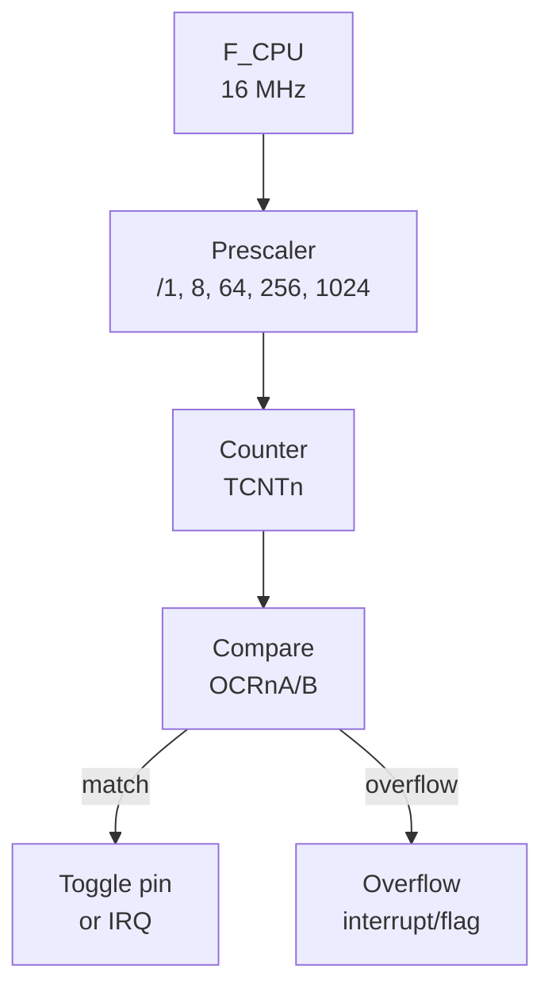

import TawkWidget from '../../../../components/TawkWidget.astro';
import UniversalContentContributors from '../../../../components/UniversalContentContributors.astro';
import PodcastEmbed from '../../../../components/PodcastEmbed.astro';
import InArticleAd from '../../../../components/InArticleAd.astro';
import Copyright from '../../../../components/Copyright.astro';
import BionicText from '../../../../components/BionicText.astro';
import TailwindWrapper from '../../../../components/TailwindWrapper.jsx';
import { Tabs, TabItem } from '@astrojs/starlight/components';
import { Card, CardGrid, Badge, Steps, LinkButton, FileTree } from '@astrojs/starlight/components';

<UniversalContentContributors 
  contributors={frontmatter.contributors}
/>


import EmbeddedProgrammingAtmega328pComments from '../../../../components/embedded-programming-atmega328p/EmbeddedProgrammingAtmega328pComments.astro';

Timers are the workhorses of embedded systems. They count clock cycles in hardware, freeing the CPU to do other work while generating precise time intervals, PWM signals, and frequency outputs. The ATmega328P has three timers, and in this lesson you will configure all of them. The project is a tone generator: two buttons step the frequency up and down, and a piezo buzzer plays the tone using Timer1 in CTC mode with hardware output compare. You will hear exactly how prescalers and compare values translate into audible frequencies. #Timers #CTC #PWM

<PodcastEmbed src="https://open.spotify.com/episode/2lQEZPMY8cpp8XPVwukUL0?si=heWxjaGaSjaHnCwWzdW3ig" />

## What We Are Building

<Card title="Tunable Tone Generator" icon="star">
A piezo buzzer driven by Timer1 in CTC mode with hardware toggle on the OC1A pin. Two push buttons adjust the frequency up and down in semitone steps across two octaves (C4 through C6, roughly 262 Hz to 1047 Hz). The frequency calculation is done entirely from the timer formula: f = F_CPU / (2 * prescaler * (1 + OCR1A)). No delay loops are involved in tone generation.
</Card>

**Project specifications:**

| Parameter | Value |
|-----------|-------|
| MCU | ATmega328P (on Arduino Nano or Uno) |
| Timer | Timer1 (16-bit) in CTC mode |
| Output pin | OC1A (PB1, Arduino D9) |
| Frequency range | 262 Hz to 1047 Hz |
| Steps | Semitone increments (12 per octave) |
| Prescaler | 8 (gives good resolution in audible range) |
| Buttons | Up (PD6), Down (PD7) |

### Parts for This Lesson

| Ref | Component | Quantity | Notes |
|-----|-----------|----------|-------|
| 1 | Arduino Nano or Uno (ATmega328P) | 1 | From previous lessons |
| 2 | Breadboard | 1 | From previous lessons |
| 3 | Piezo buzzer (passive) | 1 | Must be passive, not active |
| 4 | Push buttons (tactile) | 2 | Reuse 1 from Lesson 2, add 1 new |
| 5 | Jumper wires | ~8 | Male-to-male |

## Timer Architecture Overview

<InArticleAd />


The timer subsystem takes the system clock, divides it through a prescaler, and feeds the result into a counter register. When the counter reaches a compare value or overflows, it can trigger actions like toggling an output pin or firing an interrupt.



Each timer in the ATmega328P is a hardware counter clocked by the system clock (or a prescaled version of it). Timer0 and Timer2 are 8-bit (count 0 to 255), while Timer1 is 16-bit (count 0 to 65535). The timer increments on each clock tick and can trigger actions when it reaches specific values.

| Timer | Width | Compare Channels | PWM Pins | Special Features |
|-------|-------|-------------------|----------|-----------------|
| Timer0 | 8-bit | OCR0A, OCR0B | OC0A (PD6), OC0B (PD5) | Used by Arduino delay() |
| Timer1 | 16-bit | OCR1A, OCR1B | OC1A (PB1), OC1B (PB2) | Input capture, 16-bit resolution |
| Timer2 | 8-bit | OCR2A, OCR2B | OC2A (PB3), OC2B (PD3) | Async mode with external 32 kHz crystal |

### Timer Modes

| Mode | How It Works | Use Case |
|------|-------------|----------|
| Normal | Counts 0 to MAX, overflows to 0 | Simple timing, overflow interrupts |
| CTC (Clear Timer on Compare) | Counts 0 to OCRnA, resets to 0 | Precise frequency generation |
| Fast PWM | Counts 0 to MAX (or OCRnA), single slope | LED dimming, motor speed |
| Phase Correct PWM | Counts up then down, dual slope | Smoother analog output |

### Prescaler Options

The prescaler divides the system clock before it reaches the timer counter. A 16 MHz clock with prescaler 8 gives a 2 MHz timer tick, meaning each count takes 0.5 microseconds. Larger prescalers allow longer intervals but reduce resolution. For a broader look at how counters, prescalers, and frequency dividers work at the digital logic level, see [Digital Electronics: Counters, Timers, and Dividers](/education/digital-electronics/counters-timers-dividers/).

| Prescaler | Timer Clock (at 16 MHz) | Tick Period | 8-bit Max Period | 16-bit Max Period |
|-----------|------------------------|-------------|-------------------|-------------------|
| 1 | 16 MHz | 62.5 ns | 16 us | 4.1 ms |
| 8 | 2 MHz | 500 ns | 128 us | 32.8 ms |
| 64 | 250 kHz | 4 us | 1.024 ms | 262 ms |
| 256 | 62.5 kHz | 16 us | 4.096 ms | 1.049 s |
| 1024 | 15.625 kHz | 64 us | 16.384 ms | 4.194 s |

## CTC Mode Frequency Formula

<InArticleAd />


In CTC mode, the timer counts from 0 to the value in OCRnA, then resets. If you configure the output compare pin to toggle on each match, you get a square wave.

```text
  CTC mode waveform (toggle on compare match):

  TCNTn
    ^
    |     /|    /|    /|    /|
  OCRnA /  |  /  |  /  |  /  |
    | /    |/    |/    |/    |
    +------+-----+-----+------> time
           reset reset reset

  OC1A pin (toggle mode):
    ____      ____      ____
   |    |    |    |    |    |
   |    |____|    |____|    |___
         ^         ^
      one period = 2*(1+OCRnA) ticks
```

The frequency of that square wave is:

```
f_out = F_CPU / (2 * prescaler * (1 + OCR1A))
```

Solving for OCR1A:

```
OCR1A = (F_CPU / (2 * prescaler * f_out)) - 1
```

For example, to generate 440 Hz (concert A) with prescaler 8:

```
OCR1A = (16000000 / (2 * 8 * 440)) - 1 = 2272
```

## Semitone Frequency Table

<InArticleAd />


Musical notes follow an exponential scale where each semitone is the previous frequency multiplied by the twelfth root of 2 (approximately 1.0595). The table below gives OCR1A values for two octaves starting from Middle C, calculated with prescaler 8.

| Note | Frequency (Hz) | OCR1A (prescaler 8) |
|------|----------------|---------------------|
| C4 | 262 | 3816 |
| C#4 | 277 | 3607 |
| D4 | 294 | 3400 |
| D#4 | 311 | 3213 |
| E4 | 330 | 3029 |
| F4 | 349 | 2862 |
| F#4 | 370 | 2702 |
| G4 | 392 | 2550 |
| G#4 | 415 | 2406 |
| A4 | 440 | 2272 |
| A#4 | 466 | 2144 |
| B4 | 494 | 2023 |
| C5 | 523 | 1910 |
| C6 | 1047 | 954 |

## Complete Firmware

<InArticleAd />


```c
#define F_CPU 16000000UL

#include <avr/io.h>
#include <util/delay.h>

/* OCR1A values for C4 to C6 (25 semitones, prescaler 8) */
static const uint16_t notes[] = {
    3816, 3607, 3400, 3213, 3029, 2862,  /* C4  to F4  */
    2702, 2550, 2406, 2272, 2144, 2023,  /* F#4 to B4  */
    1910, 1803, 1702, 1607, 1516, 1431,  /* C5  to F5  */
    1350, 1275, 1203, 1135, 1072, 1011,  /* F#5 to B5  */
    954                                    /* C6         */
};

#define NUM_NOTES (sizeof(notes) / sizeof(notes[0]))
#define BTN_UP   PD6
#define BTN_DOWN PD7

static uint8_t debounce(uint8_t pin)
{
    if (!(PIND & (1 << pin))) {
        _delay_ms(50);
        if (!(PIND & (1 << pin)))
            return 1;
    }
    return 0;
}

int main(void)
{
    /* OC1A (PB1) as output for tone */
    DDRB |= (1 << PB1);

    /* Buttons as inputs with pull-ups */
    DDRD &= ~((1 << BTN_UP) | (1 << BTN_DOWN));
    PORTD |= (1 << BTN_UP) | (1 << BTN_DOWN);

    /* Timer1: CTC mode, toggle OC1A on compare match, prescaler 8 */
    TCCR1A = (1 << COM1A0);              /* Toggle OC1A on match */
    TCCR1B = (1 << WGM12) | (1 << CS11); /* CTC mode, prescaler 8 */

    uint8_t note_idx = 9;  /* Start at A4 (440 Hz) */
    OCR1A = notes[note_idx];

    while (1) {
        if (debounce(BTN_UP)) {
            if (note_idx < NUM_NOTES - 1) {
                note_idx++;
                OCR1A = notes[note_idx];
            }
            while (!(PIND & (1 << BTN_UP)));  /* Wait for release */
            _delay_ms(50);
        }

        if (debounce(BTN_DOWN)) {
            if (note_idx > 0) {
                note_idx--;
                OCR1A = notes[note_idx];
            }
            while (!(PIND & (1 << BTN_DOWN)));
            _delay_ms(50);
        }
    }
}
```

## How the Hardware Toggle Works

<InArticleAd />


Setting COM1A0 in TCCR1A tells the hardware to toggle the OC1A pin every time TCNT1 matches OCR1A. The timer automatically resets to 0 (CTC mode), and the cycle repeats. This produces a square wave with a period of 2 * (1 + OCR1A) timer ticks. The CPU does not need to execute any code for the tone to keep playing; it only intervenes when you change the frequency.

## PWM Mode Preview

<InArticleAd />


CTC mode generates precise frequencies, but timers can also produce variable-width pulses. PWM (Pulse Width Modulation) is a technique where you rapidly switch a digital pin on and off at a fixed frequency, varying the fraction of time it stays on (the "duty cycle") to control the average power delivered to a load. Fast PWM mode uses the same counter and compare registers, but instead of toggling the pin at each match, it controls how long the pin stays high within each cycle. You will use this extensively in later lessons for motor control and LED dimming.

```text
  Fast PWM waveform:

  TCNTn
    ^
 MAX|    /|    /|    /|
    |   / |   / |   / |
 OCR|--/--+--/--+--/--+-- duty cycle
    | /   | /   | /   |
    |/    |/    |/    |
    +-----+-----+-----+-----> time

  Output pin:
    ___   ___   ___
   |   | |   | |   |
   |   |_|   |_|   |_______
    <-->
    duty = OCRnA / MAX
```

The duty cycle controls the average voltage. You will use PWM extensively in later lessons for analog-like outputs.

```c
/* Example: Fast PWM on Timer0, ~62.5 kHz, 50% duty */
TCCR0A = (1 << COM0A1) | (1 << WGM01) | (1 << WGM00);
TCCR0B = (1 << CS00);  /* No prescaler */
OCR0A = 127;            /* 50% duty cycle */
DDRD |= (1 << PD6);    /* OC0A output */
```

## Exercises

<InArticleAd />


1. Add a third button that mutes the tone by disconnecting the output compare (clear COM1A0 in TCCR1A) and re-enables it on the next press.
2. Program a melody: store a sequence of note indices and durations in an array, then play them in order using Timer1 for the tone and a delay loop for timing.
3. Use Timer0 in Normal mode with an overflow interrupt to create a 1 ms system tick. Use this tick to implement a non-blocking button debouncer.
4. Calculate the exact frequency error for each note in the semitone table. How far off is each note from the ideal frequency, and which notes have the largest error?

## Summary

<InArticleAd />


You now understand how the ATmega328P timers work at the register level. You can configure CTC mode for precise frequency generation, calculate OCR values from a target frequency, and use hardware output compare to generate signals without CPU intervention. The prescaler and compare value together determine the output frequency with a simple formula. These concepts carry directly into PWM, input capture, and interrupt-driven timing in the lessons ahead.

<EmbeddedProgrammingAtmega328pComments />


<InArticleAd />
<TawkWidget />
<Copyright />